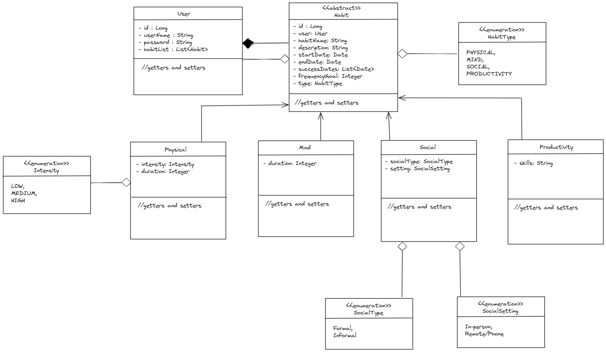
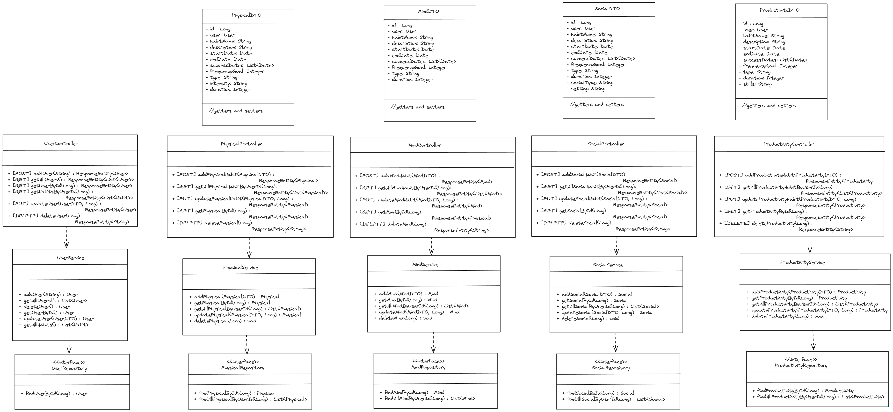
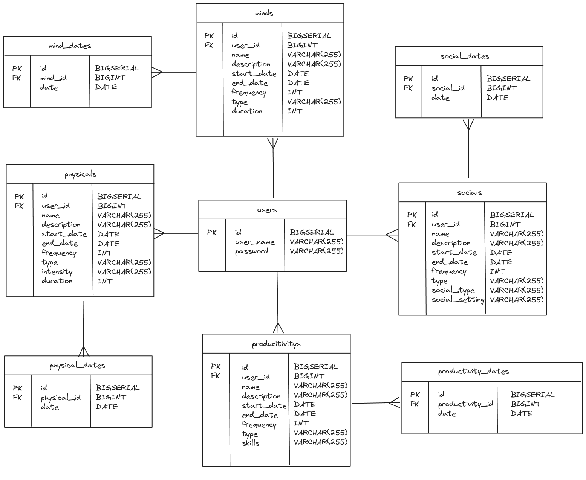

# Habit Tracker - RESTful API

## TABLE OF CONTENTS

> 1. [Description](#1-description)
> 2. [Model Descriptions](#2-models)
> 3. [Class Diagram](#3-class-diagram)
> 4. [Entity Relationship Diagram](#4-entity-relationship-diagram)
> 5. [How to use the API](#5-how-to-use-the-api)
> 6. [Limitations](#6-limitations)
> 7. [Tech Stack and dependencies](#7-tech-stack-and-dependencies)

## 1. Description

Inspired by Atomic Habits from James Clear. This habit tracking app is a way to monitor your progress and future ideas. 

MVP:

- Able to add habits to your profile
- Can display all habits based on type
- Can mark off success dates for habits when complete
- Can remove habits
- Can filter habits by type
- Progress of habits is visualised

### 2. Model Description

## 3. Class Diagram

### Models

### Service Layers

## 4. Entity Relationship Diagram

## 5. How to use the API
#### RESTful route endpoints

### 6. Limitations

## 7. Tech Stack and dependencies
The technologies used for this project are:
- Intellij IDEA, running JDK 17
- Postman
- DBeaver
- Spring Boot
- Maven

### Dependencies

- Spring Boot DevTools DEVELOPER TOOLS
- Spring Web WEB
- Spring Data JPA (SQL)
- PostgreSQL Driver 
